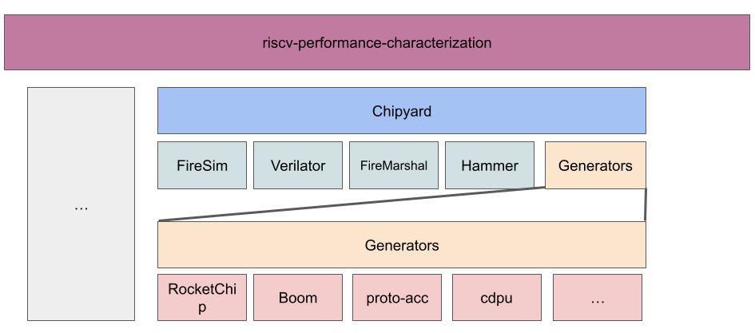

# Protocol Buffers Hardware Accelerator - ICE-RLab Docs

Hello 👋, welcome.

These docs are specific to the work done by the [ICE Research LAb](https://www.github.com/ice-rlab) that expands on the [Hardware Accelerator for Protocol Buffers](https://dl.acm.org/doi/10.1145/3466752.3480051) by S Karandikar, et. al.

## Getting Started

### Protocol Buffers

If you're new to Protocol Buffers, we recommend you start by reading and following the following pages from the official [Protocol Buffers Documentation](https://protobuf.dev):

1. Read the [Overview](https://protobuf.dev/overview/) page, and
2. Follow the [C++ Protocol Buffer Basics Tutorial](https://protobuf.dev/getting-started/cpptutorial/).

> [!TIP]
> While completing the tutorial pay attention to the components of Protocol Buffers, and their role in the serialization/deserialization workflow.
>
> Hopefully, you also noticed that protocol buffers are also referred to as "protobufs" for short.

### Protocol Buffers Hardware Accelerator

Once you have a decent understanding of protocol buffers, go ahead and read the paper:

3. [A Hardware Accelerator for Protocol Buffers](https://dl.acm.org/doi/10.1145/3466752.3480051) by S Karandikar, et. al.

> [!TIP]
> As you read the paper keep your experience from the tutorial in mind so that you notice where the hardware accelerator makes things different or the same according to the paper.

### Protocol Buffers Hardware Accelerator Project Structure

Okay okay, you got the fundamentals down. The goal here is to try to create a map in your head of the pieces involved and some of the connecting roads between them.

> [!IMPORTANT]
> Git submodules is the backbone of the structure of this project. Here are a couple of resources to get you up to speed/refresh you on git submodules:
>
> - [Git Tools - Submodules | Official git docs](https://git-scm.com/book/en/v2/Git-Tools-Submodules)
> - [Demystifying git submodules | Dmitry Mazin Developer Blog](https://www.cyberdemon.org/2024/03/20/submodules.html)
As you saw in the artifact appendix of the accelerator paper, the project consists of five git repositories:

- **protobuf-library-for-accel-ae**,
- **protoacc** (in the paper it's called *protoacc-ae*, in GitHub it's called protoacc, we'll refer to it as protoacc),
- **firesim-protoacc-ae**,
- **chipyard-protoacc-ae**,
- **HyperProtoBench**

Don't panic (just yet). We'll go one by one.

- [ice-rlab/protobuf-library-for-accel-ae](https://github.com/ice-rlab/protobuf-library-for-accel-ae/tree/accel): Our fork of the protobuf compiler, C++ runtime and library (header files) with support for the accelerator and home to these docs.
- [ice-rlab/protoacc](https://github.com/ice-rlab/protoacc): Our fork of the accelerator design, software (library for custom instructions, microbenchmarks, FireSim workloads), and scripts (that automate installation, testing and simulation).
- [sagark/firesim-protoacc-ae](https://github.com/sagark/firesim-protoacc-ae): Top-level FireSim environment with support for protocol buffers accelerator.
- [sagark/chipyard-protoacc-ae](https://github.com/sagark/chipyard-protoacc-ae): Chipyard RISC-V SoC generation environment with protocol buffers accelerator.
- [sagark/HyperProtoBench](https://github.com/sagark/HyperProtoBench): Serialization/deserialization benchmarks.

Why have we only forked the first two repos? Those are the only two repos we've done work on so far.

What is FireSim and Chipyard? Buckle up your seatbelt 💺...

### Hardware Accelerator Platform

Chipyard is the platform used to design and simulate the protocol buffers accelerator. The following diagram illustrates how FireSim fits in with Chipyard as well as other tools and how Chipyard fits within the [ice-rlab/riscv-performance-characterization]() work:

To understand how the protocol buffers accelerator was designed, simulated and tested using FireSim and Chipyard, 

- watch the [videos of the full-day tutorial at ASPLOS 2023](https://fires.im/asplos-2023-tutorial/)
- read through the official [Chipyard](https://chipyard.readthedocs.io/en/latest/#) and [FireSim](https://fires.im/) docs.
